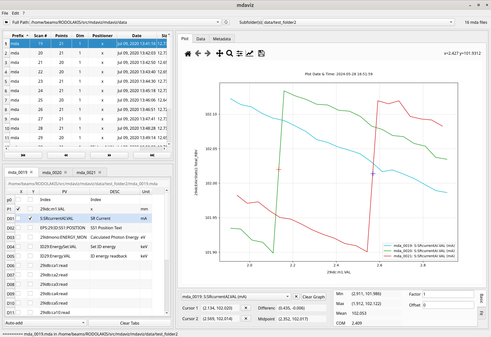

=======================
mdaviz: MDA Data Viewer
=======================

A Python Qt6 application for visualizing MDA (Measurement Data Acquisition) data with advanced curve fitting capabilities.

Key Features
============

* **Data Visualization**: Visualize MDA data with support for 1-D and multi-dimensional plots
* **Interactive Plotting**: Real-time data visualization with matplotlib integration
* **Advanced Curve Fitting**: 7 mathematical models (Gaussian, Lorentzian, Linear, Exponential, Quadratic, Cubic, Error Function)
* **Auto-Load Folders**: Automatically loads the first valid folder from recent folders list
* **Lazy Loading**: Efficient folder scanning with progress indicators for large datasets
* **Recent Folders**: Remembers recently opened folders for quick access
* **Cursor Utilities**: Interactive cursors for data analysis and range selection
* **Mathematical Analysis**: Basic mathematical information and data processing
* **Cross-Platform**: Runs on Windows, macOS, and Linux

Documentation
=============

.. icons: https://fonts.google.com/icons
.. grid:: 2 2

    .. grid-item-card:: :material-regular:`summarize;3em` User Guide
      :link: user_guide
      :link-type: doc

    .. grid-item-card:: :material-regular:`functions;3em` Fit Functionality
      :link: fit_functionality
      :link-type: doc

    .. grid-item-card:: :material-regular:`install_desktop;3em` Install
      :link: install
      :link-type: doc

    .. grid-item-card:: :material-regular:`api;3em` API
      :link: api
      :link-type: doc

   Screenshot of the mdaviz GUI displaying sample data with curve fitting.

.. toctree::
   :maxdepth: 1
   :glob:
   :caption: Contents:
   :hidden:

   user_guide
   fit_functionality
   install
   api
   changes
   license

About
=====

:home: https://bcda-aps.github.io/mdaviz/
:bug tracker: https://github.com/BCDA-APS/mdaviz/issues
:source: https://github.com/BCDA-APS/mdaviz
:license: :ref:`license`
:full version: |release|
:published: |today|
:revisions: :ref:`History of code changes <changes>`
:index: :ref:`genindex`
:module: :ref:`modindex`
:search: :ref:`search`

Acknowledgements
================

"This product includes software produced by UChicago Argonne, LLC
under Contract No. DE-AC02-06CH11357 with the Department of Energy."
