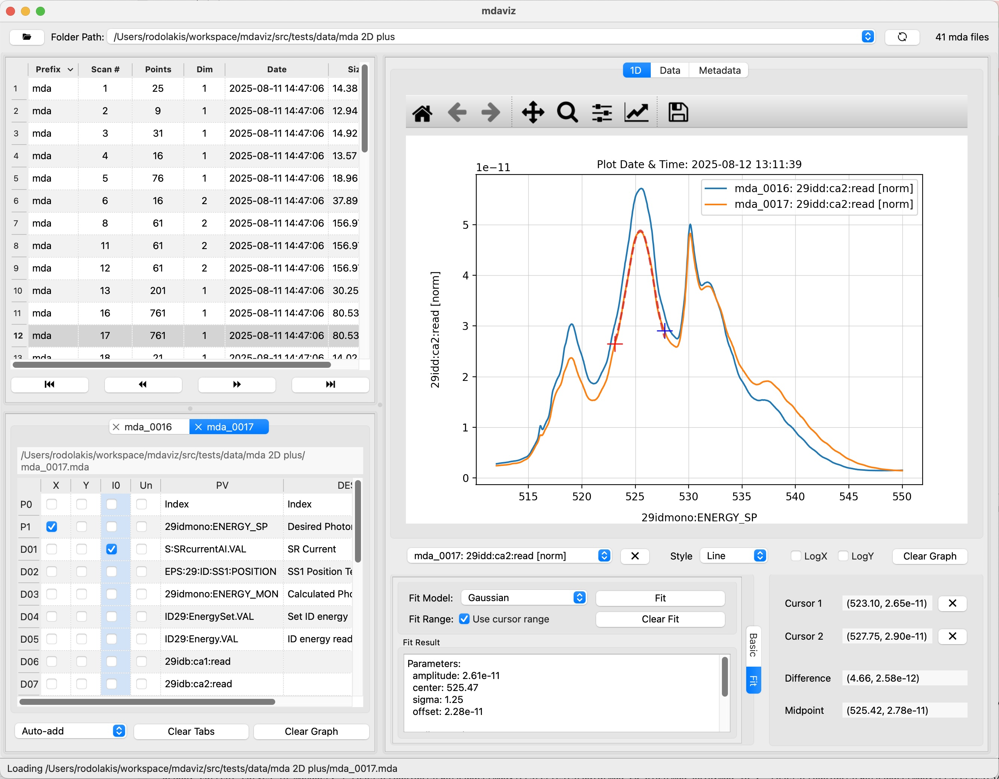

=======================
mdaviz: MDA Data Viewer
=======================

A Python Qt6 application for visualizing MDA (Multi-Dimensional Array) data.

Key Features
============

* **Data Visualization**: Visualize MDA data with support for 1-D and 2D plots (mesh scans) with matplotlib integration.
* **Auto-Load Folders**: Automatically loads the first valid folder from recent folders list (can be disabled in the preferences).
* **Recent Folders**: Remembers recently opened folders for quick access.
* **Lazy Loading**: Efficient folder scanning with progress indicators for large datasets.
* **Curve Management**: Add, remove, and style multiple data curves.
* **Axis Selection**: Select X-axis (positioners), Y-axis (detectors), I0 normalization, and curve unscaling using checkboxes. Axis selection is saved from one file to the next.
* **Curve Unscaling**: Rescale curves to match the range of other Y curves for better comparison.
* **Data Analysis**: Basic statistics, cursor measurements, and curve fitting.
* **Metadata Search**: Searchable metadata to quickly locate specific parameters and settings.
* **Cross-Platform**: Runs on macOS and Linux (Windows TBD).

Documentation
=============

.. grid:: 3

    .. grid-item-card:: |material_summarize| User Guide
      :link: user_guide
      :link-type: doc

    .. grid-item-card:: |material_install| Installation
      :link: install
      :link-type: doc

    .. grid-item-card:: |material_api| API
      :link: api
      :link-type: doc

.. |material_summarize| raw:: html

   summarize

.. |material_install| raw:: html

   install_desktop

.. |material_api| raw:: html

   api

Screenshots
-----------

   Screenshot of the mdaviz GUI displaying sample 1D data with curve fitting.

.. figure:: _static/mda2D.jpg
   :alt: fig.mda2D
   :width: 100%
   :align: center
   :figclass: align-center
   :figwidth: 100%

   Screenshot of the mdaviz GUI displaying sample 2D data.

.. toctree::
   :maxdepth: 1
   :glob:
   :caption: Contents:
   :hidden:

   user_guide
   install
   known_bugs
   api
   changes
   license

About
=====

:home: https://bcda-aps.github.io/mdaviz/
:bug tracker: https://github.com/BCDA-APS/mdaviz/issues
:source: https://github.com/BCDA-APS/mdaviz
:license: :ref:`license`
:full version: |release|
:published: |today|
:revisions: :ref:`History of code changes <changes>`
:index: :ref:`genindex`
:module: :ref:`modindex`
:search: :ref:`search`

Acknowledgements
================

"This product includes software produced by UChicago Argonne, LLC
under Contract No. DE-AC02-06CH11357 with the Department of Energy."
