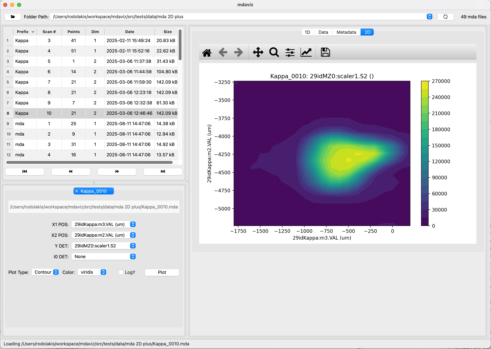

=======================
mdaviz: MDA Data Viewer
=======================

A Python Qt6 application for visualizing MDA ( Multi-Dimensional Array) data.

Key Features
============

* **Data Visualization**: Visualize MDA data with support for 1-D and 2D plots (mesh scans)
* **Interactive Plotting**: Real-time data visualization with matplotlib integration
* **Auto-Load Folders**: Automatically loads the first valid folder from recent folders list
* **Recent Folders**: Remembers recently opened folders for quick access
* **Lazy Loading**: Efficient folder scanning with progress indicators for large datasets
* **Curve Fitting**: 7 mathematical models (Gaussian, Lorentzian, Linear, Exponential, Quadratic, Cubic, Error Function)
* **Cursor Utilities**: Interactive cursors for data analysis and range selection
* **Metadata Search**: Searchable metadata to quickly locate specific parameters and settings
* **Cross-Platform**: Runs on Windows, macOS, and Linux

Documentation
=============

.. grid:: 3

    .. grid-item-card:: 📋 User Guide
      :link: user_guide
      :link-type: doc

    .. grid-item-card:: 💻 Installation
      :link: install
      :link-type: doc

    .. grid-item-card:: 🔗 API
      :link: api
      :link-type: doc

.. figure:: _static/mda1D.jpg
   :alt: fig.mda1D
   :width: 100%
   :align: center
   :figclass: align-center
   :figwidth: 100%

   Screenshot of the mdaviz GUI displaying sample 1D data with curve fitting.

   Screenshot of the mdaviz GUI displaying sample 2D data.

.. toctree::
   :maxdepth: 1
   :glob:
   :caption: Contents:
   :hidden:

   user_guide
   fit_functionality
   install
   api
   changes
   license

About
=====

:home: https://bcda-aps.github.io/mdaviz/
:bug tracker: https://github.com/BCDA-APS/mdaviz/issues
:source: https://github.com/BCDA-APS/mdaviz
:license: :ref:`license`
:full version: |release|
:published: |today|
:revisions: :ref:`History of code changes <changes>`
:index: :ref:`genindex`
:module: :ref:`modindex`
:search: :ref:`search`

Acknowledgements
================

"This product includes software produced by UChicago Argonne, LLC
under Contract No. DE-AC02-06CH11357 with the Department of Energy."
