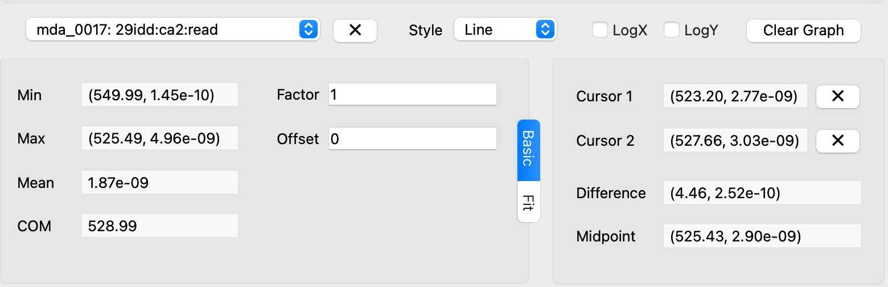
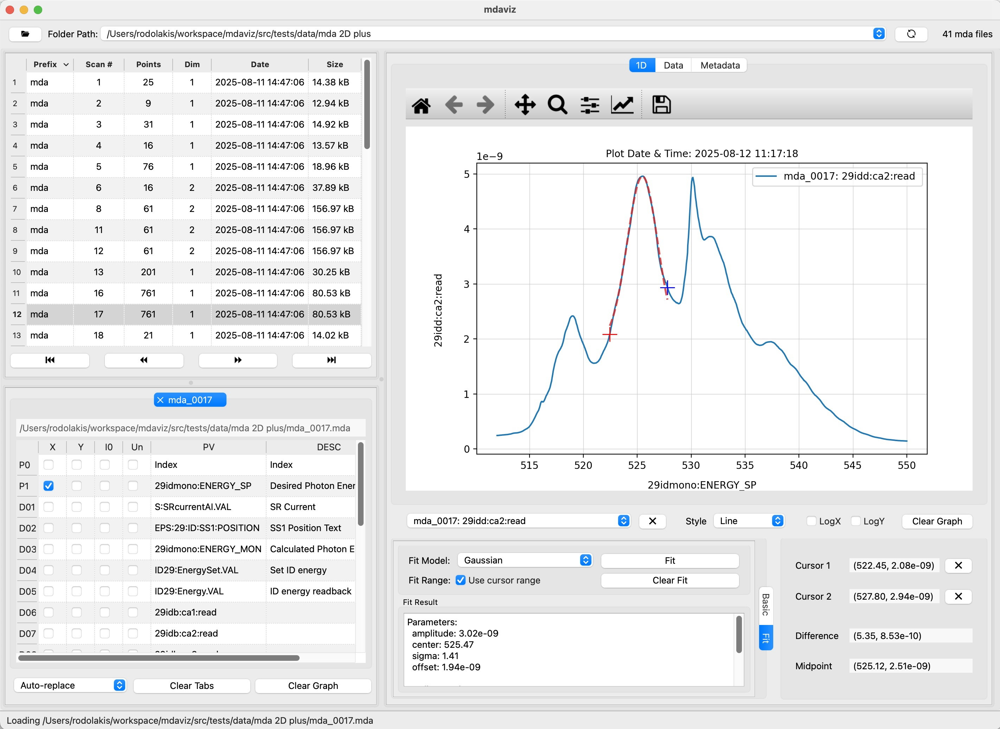

====================================
User Guide
====================================

Getting Started
---------------

`mdaviz` is a Python Qt6 application for visualizing MDA (Multi-Dimensional Array) data.

Installation
^^^^^^^^^^^^

For installation instructions, see the :doc:`install` page.

Running the Application
^^^^^^^^^^^^^^^^^^^^^^^

After installation, you can run `mdaviz` in several ways:

**From PyPI installation:**

.. code-block:: bash

    conda activate mdaviz
    mdaviz

**From source installation:**

.. code-block:: bash

    conda activate mdaviz
    cd mdaviz
    mdaviz

Basic Usage
-----------

Opening Data
^^^^^^^^^^^^

1. **Auto-Load**: The application automatically loads the first valid folder from your recent folders list. This can be enabled/disabled in the preferences.
2. **Manual Open**: Use the recent folder dropdown to select a file in a different folder or click "Open..." or the |folder_icon| icon to browse.
3. **Recent Folders**: The dropdown shows your recently opened folders for quick access.

Navigating Files
^^^^^^^^^^^^^^^^

1. **File Selection**: Click on any MDA file in the folder view to load it.
2. **Navigation**: Browse through files using the First/Previous/Next/Last buttons, scroll up and down, or use your keyboard's arrow keys.
3. **Refresh**: Click the refresh button to reload the current folder.

Data Visualization
^^^^^^^^^^^^^^^^^^

1. **Plot Mode**: Choose between Auto-replace, Auto-add, or Auto-off (i.e. add/replace manually) modes.
2. **Data Selection**: Use the checkbox columns to control what's plotted:

   - **X**: Positioner (only one allowed)
   - **Y**: Detector (multiple allowed)
   - **I0**: Select for normalization (divide Y data by this field, only one allowed)
   - **Un**: Unscale curves to match the range of other Y curves (requires Y selection on same row)

3. **Interactive Plot**: Use matplotlib's interactive features for zooming, panning, and changing figure options.
4. **Data Processing Options**:

   - **I0 Normalization**: Divide Y data by the selected I0 field to normalize intensity.
   - **Curve Unscaling ("Un" column)**: Rescale selected curves to match the range of other Y curves.

     - Select both "Y" and "Un" on the same row to unscale that curve
     - The unscaling formula: ``g(x) = ((f(x) - m) / (M - m)) * (Mg - mg) + mg``

       - `m, M`: min/max of the curve being unscaled `f(x)`
       - `mg, Mg`: global min/max of other Y curves (excluding unscaled ones)
   - **Factor/Offset**: Open the Basic tab and apply a factor and/or offset to the selected curve (from the curve dropdown)
     - ``g(x) = f(x) * factor + offset``

Curve Management
----------------

The following options apply to the *selected curve* in the curve dropdown (top left).

Remove Curve
^^^^^^^^^^^^

1. **Select Curve**: Choose the curve to fit from the curve dropdown.
2. **Remove Curve**: Click the |remove_icon| button.

Curve Style
^^^^^^^^^^^

1. **Select Curve**: Choose the curve to fit from the curve dropdown.
2. **Curve Style**: Choose between lines, markers, or both in the "Style" dropdown.

Cursor Utilities
^^^^^^^^^^^^^^^^

Cursors *snap* to the nearest data point of the *selected curve*

1. **Select Curve**: Choose the curve to fit from the curve dropdown.
2. **Cursor 1**: Middle-click or alt+right-click to set the first cursor position
3. **Cursor 2**: Right-click to set the second cursor position
4. **Range Selection**: Use cursors to define fitting ranges
5. **Data Analysis**: View mathematical information between cursor positions (difference between cursors & midpoint)
6. **Remove Cursor**: Click the |remove_icon| button next to the cursor value.

Basic Statistics
^^^^^^^^^^^^^^^^

1. **Select Curve**: Choose the curve to fit from the curve dropdown.
2. **Basic Statistics**: View basic statistics of the curve in the "Basic" tab: `min`, `max`, `mean`, `COM`.

Factor / Offset
^^^^^^^^^^^^^^^

1. **Select Curve**: Choose the curve to fit from the curve dropdown.
2. **Data scaling**: Open the Basic tab and apply a factor and/or offset to the selected curve: ``f(x) = f(x) * factor + offset``.

Curve Fitting
^^^^^^^^^^^^^

1. **Select Curve**: Choose the curve to fit from the curve dropdown.
2. **Choose Model**: Select a fit model from the "Fit Model" dropdown in the "Fit" tab.
3. **Set Range** (optional): Check "Use cursor range" if you want to fit only a portion of the data.
4. **Perform Fit**: Click the "Fit" button.
5. **View Results**: The fit results will appear in the "Fit Results" section
6. **Available models**: Gaussian, Lorentzian, Linear, Exponential, Quadratic, Cubic, Error Function.

2D Data Visualization
---------------------

1. **Load 2D Data**: Open an MDA file containing multi-dimensional data.
2. **Choose Visualization Mode**:
   - **1D Slices**: Select the 1D tab for line plots
   - **2D Maps**: Select the 2D tab for 2D maps
3. **For 1D Slices**:
   - Select the (inner) positioner and detector(s) to plot
   - Use the spinbox to select the outer positioner value
4. **For 2D Maps**:
   - Use the dropdowns to select the positioner and detector to plot
   - Choose between heatmap or contour plot display
   - Adjust color scale or select log scale as needed
   - Optionally, apply normalization by selecting a detector as I0
   - For 2D mapping, the data should have more than 1 point in the outer dimension

Troubleshooting
---------------

Common Issues
^^^^^^^^^^^^^

**Application won't start:**

- Ensure PyQt6 is properly installed: `pip install PyQt6 Qt6`
- Check conda environment is activated: `conda activate mdaviz`
- Verify Python version (3.10+ required)

**No data displayed:**

- Check that the selected folder contains MDA files
- Check that the selected file is not corrupted (no points in the file) or contains only one point
- Verify file permissions
- Try refreshing the folder view

:doc:`known_bugs`:

1. After switching from the 2D tab to the 1D tab, basic statistics (min, max, mean, COM) may display "n/a" for curves that were previously working correctly.

   - Workaround: manipulate the curve in any way (change style, offset, factor, or apply a fit)

2. The plotting area sometimes expands vertically beyond reasonable bounds:

   - Workaround: set the maximum plot height to a reasonable value (e.g., 600 pixels) in the preferences

**Fitting fails:**

- Ensure sufficient data points (at least 3 per parameter)
- Try a different fit model
- Check for invalid data values

**Performance issues:**

- Large datasets may take time to load

Testing & Development
---------------------

To run all tests:

.. code-block:: bash

    pytest src/tests

To run code quality checks:

.. code-block:: bash

    pre-commit run --all-files

To run type checking:

.. code-block:: bash

    mypy src/mdaviz

Contributing
------------

- Fork the repository and create a branch for your feature or bugfix.
- Add or update tests for your changes.
- Run pre-commit, mypy and pytest to ensure all checks pass.
- Submit a pull request on GitHub.

For detailed contributing guidelines, see the project's GitHub repository.

.. |folder_icon| raw:: html

   folder

.. |remove_icon| raw:: html

   close

Logging and Debugging
---------------------

**Default Behavior:**
By default, `mdaviz` logs at the INFO level, showing progress messages, file loading status, and important application events.

**Command Line Options:**
You can control the logging level using the ``--log`` argument:

.. code-block:: bash

    # Show only warnings and errors (quiet mode)
    mdaviz --log warning

    # Show all messages including debug information
    mdaviz --log debug

    # Show only errors and critical messages
    mdaviz --log error

**Available Log Levels:**

- **debug**: Most verbose - shows all messages including detailed debugging information
- **info**: Default level - shows progress, file operations, and general application status
- **warning**: Shows warnings, errors, and critical messages
- **error**: Shows only errors and critical messages
- **critical**: Shows only critical errors

**Environment Variables:**
You can also enable debug mode using the environment variable:

.. code-block:: bash

    # Enable debug mode via environment variable
    export MDAVIZ_DEBUG=1
    mdaviz

**Log Files:**
Log files are automatically created in ``~/.mdaviz/logs/`` with timestamps. Old log files (older than 1 day) are automatically cleaned up on startup.
